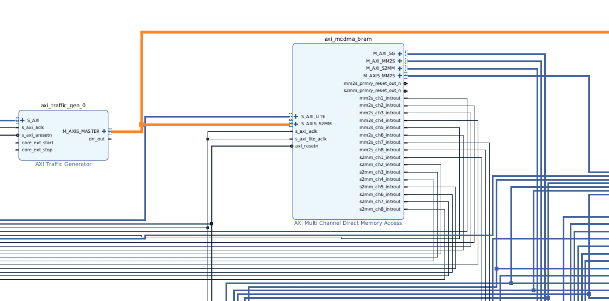
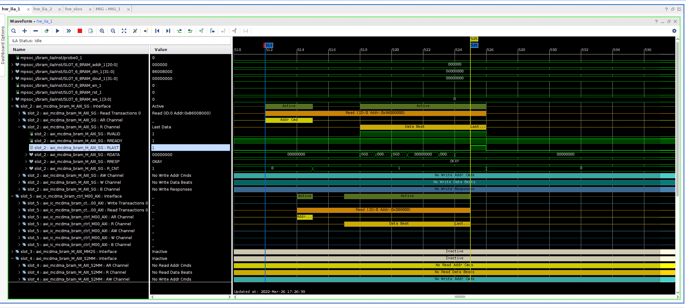
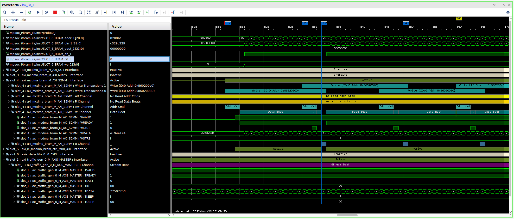

# Standalone-AXI-MCDMA-Driver

一个可以独立使用的AXI Multichannel DMA驱动。

## 功能
1. 轮询方式使用MCDMA（TODO）
2. 中断方式使用MCDMA（TODO）
### 测试MM2S和S2MM口回接
1. MM2S对应的通道一切正常
2. S2MM对应的通道会报pkt_irq中断（暂未解决）
### 测试S2MM写URAM

1. 注意Traffic generator中 Transfer bytes = Trans_length * traffic_gen_data_width/8，否则S2MM对应的通道会报Short Fall错误（意思是S2MM的Stream信号transaction字节数大于所有buffer descriptor指定的字节数）
2. Traffic generator中 Transfer Length 寄存器，高16位是单调递增的，如果reset信号没有接，则这16位不会清零。

## 如何使用
编辑 `ram_addr.h` 文件，为MCDMA指定一段独立的地址空间，其中包括buffer descriptor的空间和数据的空间  
编辑 `mcdma_addr.h` 文件，修改 MCDMA_BASE_ADDR 定义，这是AXI MCDMA 用到的寄存器基地址

## 性能测试
1. RAM地址空间使用URAM时的性能

    读SG Buffer Desciptor，发出读地址请求后，到收到第一个数据大概6 Cycles左右

    写URAM，发出写地址请求，到收到写Resp，一次写事务AWLen=15，大概20 Cycles左右

2. RAM地址空间使用DRAM时的性能（TODO）